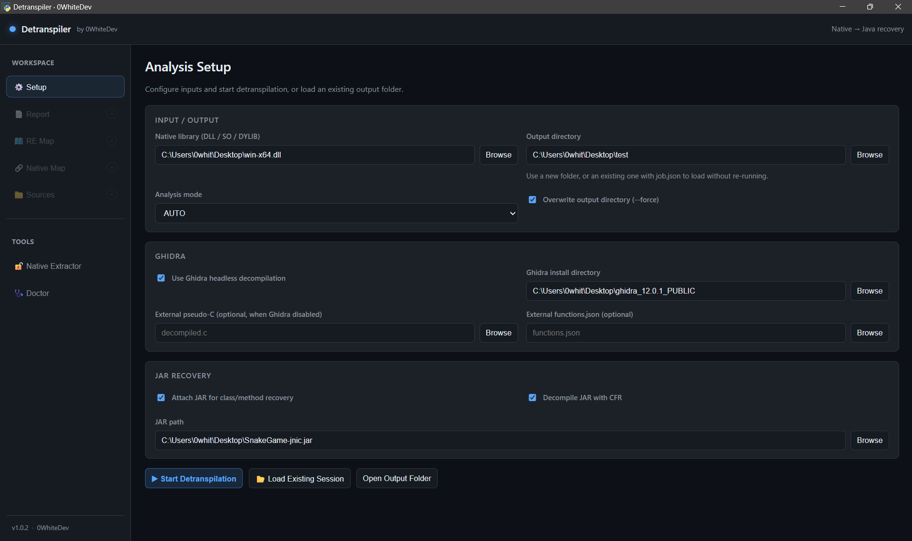
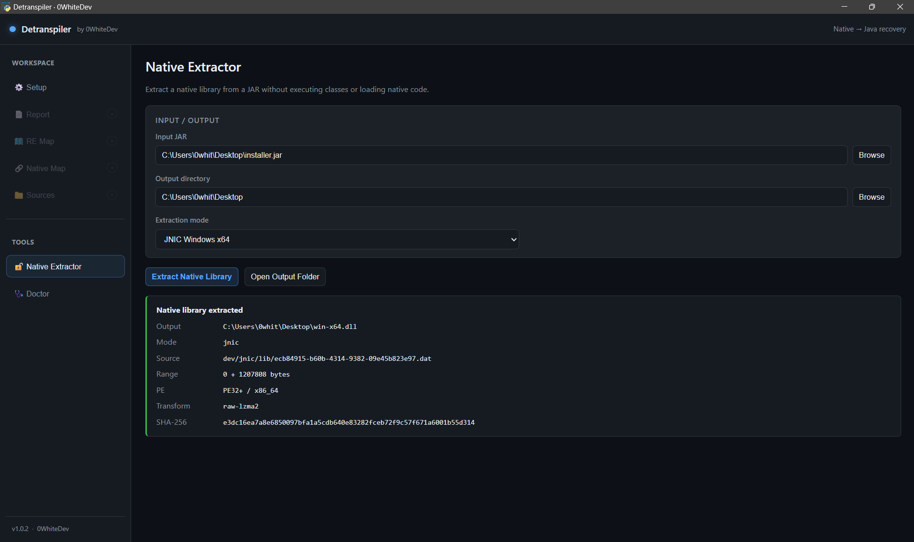
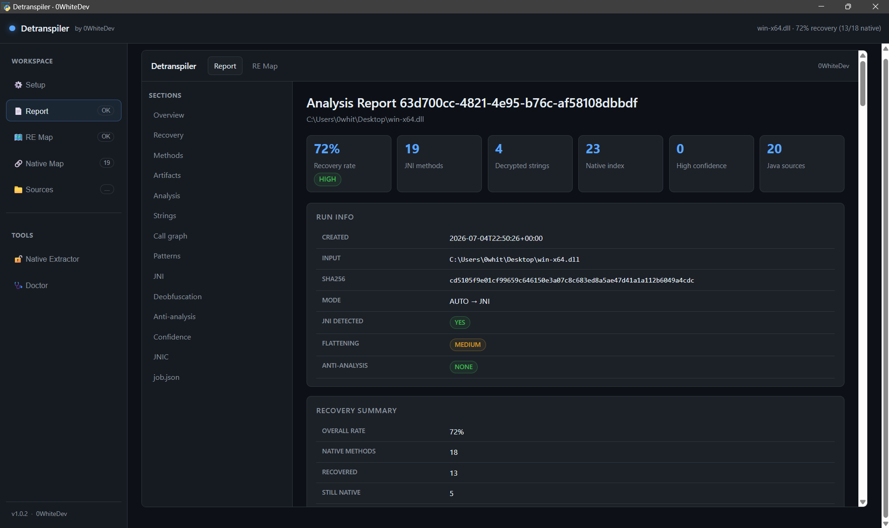
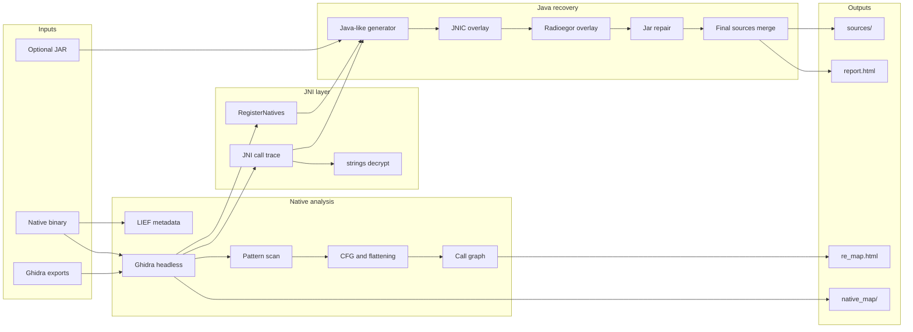

<p align="center">
  
</p>

<h1 align="center">Detranspiler</h1>

<p align="center">
  <strong>Recover Java source from JNI-native binaries.</strong><br>
  Decompile native code, trace JNI, rebuild Java-like methods, and explore results in a desktop RE workspace.
</p>

<p align="center">
  <a href="#quick-start">Quick Start</a>
  &nbsp;&bull;&nbsp;
  <a href="#features">Features</a>
  &nbsp;&bull;&nbsp;
  <a href="#cli-reference">CLI</a>
  &nbsp;&bull;&nbsp;
  <a href="#desktop-gui">GUI</a>
  &nbsp;&bull;&nbsp;
  <a href="#output-layout">Output</a>
  &nbsp;&bull;&nbsp;
  <a href="#architecture">Architecture</a>
  &nbsp;&bull;&nbsp;
  <a href="#development">Development</a>
</p>

<p align="center">
  <a href="https://github.com/0WhiteDev/detranspiler/actions/workflows/ci.yml"></a>
  <a href="LICENSE"></a>
  
  
  
</p>

---

## What is Detranspiler?

Detranspiler is a reverse-engineering pipeline for **Java applications that ship logic inside native libraries** (Windows DLL, Linux SO, macOS dylib). Typical targets include:

- JNI wrappers produced by bytecode-to-native transpilers
- JNIC-protected jars with `RegisterNatives` tables
- Radioegor / native-obfuscator style loaders (`native0.Loader`, `Hidden0`, etc.)
- Mixed binaries where Java method names survive in exports, strings, or registration metadata

The tool does **not** promise perfect decompilation of every method. It combines multiple recovery sources, scores confidence honestly, and produces **reviewable Java-like source**, HTML reports, and interactive maps so you can finish recovery manually with full context.

### What you get after a run

| Deliverable | Purpose |
|-------------|---------|
| `pseudocode/sources/` | Layer-merged Java files (best available body per method) |
| `analysis/report.html` | Human-readable analysis summary |
| `analysis/re_map.html` | Interactive graph: Java methods, native functions, JNI calls |
| `native_map/` | Per-method C files linked to Java `native` declarations |
| `recovered_project/` | Exportable project tree with manifest and confidence metadata |
| `job.json` | Single machine-readable record of the entire analysis |

---

## Quick Start

### Requirements

| Component | Required | Notes |
|-----------|----------|-------|
| Python | 3.10+ | Tested on 3.10 through 3.14 |
| Java runtime | Recommended | Needed for CFR jar decompilation |
| Ghidra | Optional | Headless decompilation of native code |
| pywebview | Optional | Desktop GUI only |

### Install

```bash
git clone https://github.com/0WhiteDev/Detranspiler.git
cd detranspiler
python -m venv .venv

# Windows
.venv\Scripts\activate

# Linux / macOS
source .venv/bin/activate

pip install -e .
pip install -e ".[gui]"    # optional desktop GUI
```

On Linux, `.[gui]` installs pywebview only. You still need a webview backend.
For Qt (recommended inside a virtual environment):

```bash
pip install PyQt6 PyQt6-WebEngine qtpy
```

Without `PyQt6-WebEngine`, the GUI can fail with `ModuleNotFoundError: No module named 'PyQt6.QtWebEngineCore'`.

### Verify environment

```bash
python -m detranspiler doctor
```

Set Ghidra when you want headless decompilation:

```bash
# Windows PowerShell
$env:GHIDRA_INSTALL_DIR = "C:\ghidra\ghidra_11.0_PUBLIC"

# Linux / macOS
export GHIDRA_INSTALL_DIR=/opt/ghidra

# Linux Flatpak (system install)
export GHIDRA_INSTALL_DIR=/var/lib/flatpak/app/org.ghidra_sre.Ghidra/current/active/files/lib/ghidra

# Linux Flatpak (user install)
export GHIDRA_INSTALL_DIR=$HOME/.local/share/flatpak/app/org.ghidra_sre.Ghidra/current/active/files/lib/ghidra
```

If your shell is Fish, for example on some CachyOS setups:

```fish
set -x GHIDRA_INSTALL_DIR /var/lib/flatpak/app/org.ghidra_sre.Ghidra/current/active/files/lib/ghidra
```

### Extract a native library from a JAR

Run this before detranspilation when the native library is packaged inside a JAR:

```bash
# One directly embedded DLL
python -m detranspiler extract --jar application.jar --out ./native --mode standard

# JNIC .dat bundle, Windows x64 payload
python -m detranspiler extract --jar application.jar --out ./native --mode jnic
```

The extractor never executes JAR classes or loads the resulting DLL. It validates ZIP
limits and paths, derives the JNIC Windows x64 range from loader bytecode, decodes a
recognized stream transform, validates the result as an AMD64 PE32+ DLL, and writes
extraction.json with the source entry, range, transform, PE metadata, and SHA-256.

Ambiguous or unsupported layouts fail with an explicit error instead of selecting a
candidate heuristically.

### Run analysis

Minimal example (native library only):

```bash
python -m detranspiler analyze native.dll --out ./out --force
```

Recommended example (native + jar for better Java recovery):

```bash
python -m detranspiler analyze native.dll \
  --out ./out \
  --jar application.jar \
  --ghidra-install-dir "$GHIDRA_INSTALL_DIR" \
  --force
```

Reuse existing Ghidra exports (skip headless run):

```bash
python -m detranspiler analyze native.dll \
  --out ./out \
  --pseudo-c ./existing/decompiled.c \
  --functions-json ./existing/functions.json \
  --strings-json ./existing/strings.json \
  --jar application.jar \
  --no-ghidra \
  --force
```

### Launch desktop GUI

```bash
python -m detranspiler gui
```

The GUI supports fresh analysis, loading an existing output folder (`job.json`), browsing recovered sources, opening reports, and exploring the native map.

---

## Desktop GUI

The desktop GUI provides the complete workflow in one workspace: configure or load an analysis, extract native libraries from JAR files, inspect reports and the RE map, and browse recovered Java and native code. It uses **pywebview** and keeps analysis local on your machine.

<table>
  <tr>
    <td align="center"><strong>Analysis setup</strong></td>
    <td align="center"><strong>Native extractor</strong></td>
    <td align="center"><strong>Recovery workspace</strong></td>
  </tr>
  <tr>
    <td></td>
    <td></td>
    <td></td>
  </tr>
</table>

---

## Features

<details open>
<summary><strong>Core pipeline</strong></summary>

- **Binary introspection** with LIEF: format detection (PE / ELF / Mach-O), exports, imports, ASCII strings
- **Ghidra headless integration** with bundled export scripts (`decompiled.c`, `functions.json`, `strings.json`)
- **JNI auto-detection** and mode resolution (`AUTO` picks `JNI` when indicators are present)
- **Pattern scanning** across exports, imports, strings, and pseudo-C (crypto, anti-debug, network, compression, JNI APIs)
- **CFG analysis** and **control-flow flattening** detection with recovery hints
- **Call graph construction** linking native functions, JNI registration, and Java exports
- **Anti-analysis profiling** to flag low-trust symbols before recovery

</details>

<details>
<summary><strong>JNI and deobfuscation</strong></summary>

- **RegisterNatives recovery** (`jni_register.json`) with class/method/signature mapping
- **JNI call extraction** from decompiled C (`jni_calls.json`)
- **JNIC detection** (loader exports, encrypted names, flattened dispatch)
- **JNIC body reconstruction** from JNI vtable traces in decompiled code
- **OnLoad keystream** and **string decryption** passes for obfuscated string pools
- **Deobfuscation risk scoring** with strategy selection for fallback recovery order

</details>

<details>
<summary><strong>Java recovery layers</strong></summary>

Recovery merges multiple layers into `pseudocode/sources/` (last layer wins):

| Layer | Source | Role |
|-------|--------|------|
| `jar_sources` | CFR decompilation of input JAR | Ground-truth structure, modifiers, non-native methods |
| `jni` / `jni_exports` | Generated from native index | JNI-linked class stubs and recovered bodies |
| `jnic` | JNIC-specific overlay | Loader/register classes and traced methods |
| `radioegor_sources` | Radioegor overlay | Native-obfuscator jar repair, record canonicalization, accessor recovery |

Additional recovery mechanisms:

- Bytecode-to-Java inference from Ghidra pseudo-C
- Pseudocode-driven return/void/control-flow synthesis
- Inter-procedural helper inlining
- Flattening-aware switch recovery
- JAR-guided CFR fallback and **jar repair** pass for stubborn stubs
- Field accessor and constant-string recovery for transpiled JNI bodies
- Java `record` canonicalization when CFR emits `extends Record`

</details>

<details>
<summary><strong>Reporting and exploration</strong></summary>

- **HTML report** with recovery metrics, obfuscation summary, artifact links
- **RE Map** (`re_map.html`): pan/zoom graph of Java classes, native functions, JNI APIs, registration edges
- **Native Map** (`native_map/`): README plus one `.c` file per Java native method with decompiled body
- **Recovery metrics** with honest per-class native recovery rate (recovered vs still-`native` in final sources)
- **Method confidence** levels (`MINIMAL` through `HIGH`) and export filtering
- **Job summarizer** CLI for terminal-friendly status

</details>

<details>
<summary><strong>Desktop GUI</strong></summary>

Built with **pywebview** (Edge WebView2 on Windows):

| Tab | Function |
|-----|----------|
| Setup | Configure DLL, JAR, Ghidra path, output folder; run or load session |
| Native Extractor | Safely recover an embedded DLL or a JNIC Windows x64 payload before analysis |
| Report | Embedded analysis report |
| RE Map | Interactive relationship graph |
| Native Map | Tree of Java packages/classes/methods with C viewer and syntax highlighting |
| Sources | Browse and view recovered `.java` files with syntax highlighting |
| Doctor | Environment diagnostics inside the app |

</details>

---

## CLI Reference

```text
python -m detranspiler <command> [options]
```

### `analyze`

Run the full pipeline on a native binary.

```text
python -m detranspiler analyze <input> --out <dir> [options]
```

| Option | Description |
|--------|-------------|
| `--out` | Output directory (required). Use `--force` to overwrite. |
| `--mode` | `AUTO`, `JNI`, `MANAGED`, `AOT`, `GENERIC_NATIVE` (default: `AUTO`) |
| `--jar` | Companion JAR for CFR decompilation and guided recovery |
| `--no-jar-decompile` | Skip CFR when a jar is provided |
| `--no-java-validation` | Skip Java AST validation and safe source repairs | | `--javac-validation` | Run optional isolated javac validation after repairs |
| `--no-ghidra` | Skip Ghidra headless decompilation |
| `--ghidra-install-dir` | Ghidra root (or set `GHIDRA_INSTALL_DIR`) |
| `--pseudo-c` | Existing `decompiled.c` instead of running Ghidra |
| `--functions-json` | Existing Ghidra functions export |
| `--strings-json` | Existing Ghidra strings export |
| `--force` | Delete output directory if it already exists |

Exit code is non-zero when a critical stage throws (`ghidra`, `java_like`, `jni_register`, `jni_calls`, or `report`).

### `extract`

Safely extract the native input before analysis.

```text
python -m detranspiler extract --jar <file.jar> --out <dir> --mode standard|jnic
```

| Option | Description |
|--------|-------------|
| `--jar` | Input JAR (required) |
| `--out` | Output directory (required); existing output files are never overwritten |
| `--mode standard` | Require exactly one embedded .dll and validate it as a PE DLL |
| `--mode jnic` | Recover the Windows x64 range from a JNIC loader and write win-x64.dll |

JNIC mode supports direct concatenated data and the raw LZMA2 stream wrapper used by
the recognized JNIC loader. Unknown transforms, ambiguous loaders, missing resources,
invalid ranges, and non-AMD64 payloads return a non-zero exit code with a stable error
identifier.

### `doctor`

Print dependency and toolchain diagnostics (Python, lief, pefile, Java, Ghidra).

```bash
python -m detranspiler doctor
python -m detranspiler doctor --json
```

### `summarize`

Compact text summary of a completed job.

```bash
python -m detranspiler summarize path/to/job.json
python -m detranspiler summarize --out summary.txt
```

### `re-map`

Build or regenerate the interactive RE map.

```bash
python -m detranspiler re-map path/to/job.json
python -m detranspiler re-map --demo --out examples/re_map_demo.html
```

### `gui`

Launch the desktop application.

```bash
python -m detranspiler gui
python -m detranspiler gui --width 1440 --height 900
```

---

## Output Layout

After `analyze`, the output directory contains:

```text
out/
  job.json                 # master job record and artifact pointers
  metadata/                # binary metadata, exports, imports, strings
  preprocess/              # copied input binary
  ghidra/                  # Ghidra project artifacts and status
  pseudo_c/
    decompiled.c           # Ghidra pseudo-C export
  pseudocode/
    jar_sources/           # CFR output from --jar
    jni/                   # JNI recovery classes
    jni_exports/           # Java_* export oriented sources
    jnic/                  # JNIC overlay
    radioegor_sources/     # Radioegor overlay when detected
    sources/               # merged final Java tree
    sources_manifest.json  # layer provenance per file
  analysis/
    report.html
    re_map.html
    re_map.json
    recovery.json          # recovery metrics
    native_index.json
    jni_register.json
    jni_calls.json
    method_confidence.json
    java_validation.json     # AST repairs and optional javac diagnostics
    ...                    # stage JSON artifacts
  native_map/
    README.md
    c/*.c                  # per-method decompiled C
  recovered_project/       # validated exportable IDE-friendly tree
    VALIDATION.json         # validation manifest and remaining errors
    src/                    # repaired final Java sources
  logs/                    # Ghidra and tool logs
```

---

## Architecture



### Package map

| Path | Responsibility |
|------|----------------|
| `detranspiler/pipeline/` | Orchestration, binary probe utilities |
| `detranspiler/ghidra/` | Headless runner and export scripts |
| `detranspiler/binary/` | PE/ELF helpers, patterns, call graph, CFG |
| `detranspiler/jni/` | RegisterNatives parsing, vtable names, JNI synthesis |
| `detranspiler/deobfuscation/` | JNIC, anti-analysis, keystream, string decrypt |
| `detranspiler/java/` | Java-like generation, pseudocode inference, bytecode helpers |
| `detranspiler/jar/` | CFR decompilation, repair, radioegor overlay, similarity |
| `detranspiler/native/` | Native index, flattening recovery, interprocedural |
| `detranspiler/recovery/` | Metrics, confidence, strategy, project export |
| `detranspiler/reporting/` | HTML report, RE map, native map, summarizer |
| `detranspiler/validation/` | Java structure parser, safe repairs, isolated javac |
| `detranspiler/gui/` | Desktop shell, API bridge, asset bundle |

---

## Recovery model

Detranspiler reports recovery against **application classes** in final merged sources:

- A method counts as **recovered** when the `native` keyword no longer appears on that method in `pseudocode/sources/`
- A method counts as **remaining** when it is still declared `native`
- Per-class and global rates are computed from `native_index.json` cross-checked with final Java output

This avoids inflated percentages from duplicate layers or stub files. Low-confidence bodies may still appear in intermediate layers but are flagged in `method_confidence.json` and filtered on export when configured.

---

## Java validation

Final Java sources pass through a validation stage before recovered_project is exported:

1. Parse source structure and method bodies.
2. Apply conservative repairs for unambiguous missing semicolons, inferable temporary variables, literal return mismatches, known JDK imports, and identical duplicate methods.
3. Optionally run javac with annotation processing, implicit compilation, external classpaths, and external source paths disabled.
4. Record unresolved structural and compiler errors without guessing unsafe fixes.

Results are written to analysis/java_validation.json, included in the HTML report, and copied to recovered_project/VALIDATION.json. javac validation is disabled by default and can be enabled from the GUI or with --javac-validation.

---

## Configuration

| Variable | Purpose |
|----------|---------|
| `GHIDRA_INSTALL_DIR` | Root directory of Ghidra installation |
| `DETRANSPILER_SMOKE_SESSION` | Path to analyzed output folder for integration smoke tests |

GUI settings are stored in the user config directory via `detranspiler/gui/settings.py`.

---

## Development

### Run tests locally

```bash
python -m compileall detranspiler -q
python -m detranspiler doctor
python -m detranspiler re-map --demo
```

Optional integration smoke test against a real analyzed session:

```bash
# Windows PowerShell
$env:DETRANSPILER_SMOKE_SESSION = "C:\path\to\analysis\out"
python tools/smoke_test.py
```

### Project tools

| Script | Purpose |
|--------|---------|
| `tools/smoke_test.py` | End-to-end checks on an existing output folder |

### CI

GitHub Actions workflow `.github/workflows/ci.yml` runs on push and pull request:

- `compileall` on Python 3.10, 3.12, 3.14
- `doctor` health check
- Demo RE map generation
- Optional Windows smoke test when repository variable `DETRANSPILER_SMOKE_SESSION` is set

### Releases

The release workflow builds a source distribution and wheel, validates both packages, and attaches them to a GitHub Release. Its release notes contain a **Changelog** generated from commit messages added after the previous release tag and up to the new tag.

1. Update <code>project.version</code> in <code>pyproject.toml</code>.
2. Commit the release changes.
3. Create and push the matching tag, for example <code>v1.1.0</code>.

<pre><code>git tag v1.1.0
git push origin v1.1.0</code></pre>

For example, the <code>v1.0.1</code> changelog contains commits after <code>v1.0.0</code> through <code>v1.0.1</code>. The changelog is written directly into the GitHub Release notes; it is not committed or uploaded as a separate file.

The workflow rejects a tag when it does not exactly match the package version. Manual runs build downloadable workflow artifacts without publishing a GitHub Release.

---

## Limitations

- Output is **pseudocode / recovered source**, not guaranteed compilable Java
- Heavy obfuscation, missing JAR, or incomplete Ghidra decompilation reduce recovery rate
- Some stages require **Java** (CFR) and **Ghidra** for best results; the pipeline degrades gracefully when they are absent
- angr is listed in doctor diagnostics but is not required for the main pipeline

---

## Contributing

Contributions are welcome. Please open an issue before large architectural changes. For bug reports, attach `job.json`, relevant `analysis/*.json` snippets, and a minimal binary sample when possible.

1. Fork the repository
2. Create a feature branch
3. Run `python -m compileall detranspiler -q` and `python -m detranspiler doctor`
4. Open a pull request with a clear description and test notes

---

## Authors

- [@0WhiteDev](https://github.com/0WhiteDev)
- [@DevsMarket](https://github.com/DEVS-MARKET)

---

## License

[MIT](LICENSE)

---